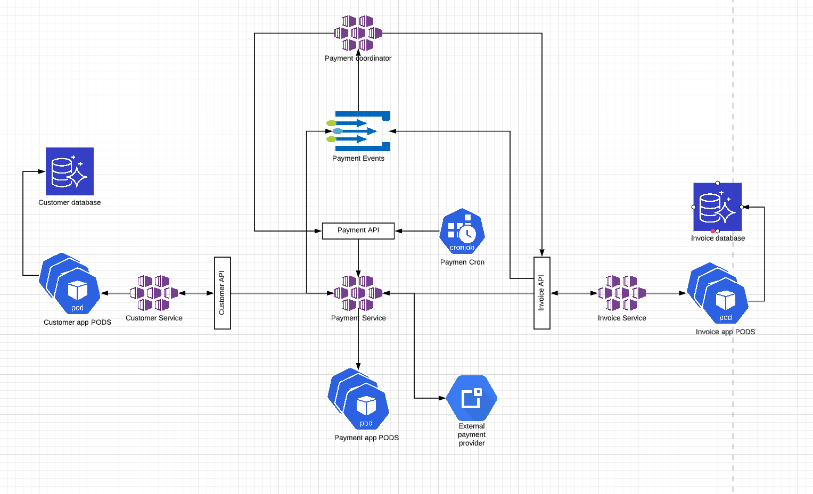

# New Architecture Proposal 

## Current architecture
Current architecture keeps all the services in 1 app, so through that app we can handle customers, invoices and payments
Having only 1 app will make the communication and the deployment simple and easy but it comes with some withdraws:
* Cannot scale specific services. If invoice service is heavily used and need to be scaled up, we cannot do it for it only, we scale everything
* Cannot isolate databases. If one of the services is being heavily used, the performance of the database and the complete service will be affected

## New architecture approach
A new approach can be taken. Let's extract the different services to different applications, so we will have 3 different apps:
* Customer app
* Invoices app
* Payment app

By having that we ensure:
* Isolation between services. If one of them is heavily used or have a poor performance, the other 2 will remain unaffected
* Different evolution. We will be able to evolve each app independently. If we decide to use a different approach for customers, using a new storage system, it won't affect the others
* Better scalability. We can scale up and down each service independently

Another changes we can apply:
* Delegate the scheduler of the monthly payment job to the deployment system. If we're using kubernetes we can create a cron job to do that and keep the responsibility there instead of the service
* Follow the API First development approach so every app will define an API first and communicate to other services to ensure the right usage
* As an idea to consider will be to use 2 entry points in every service that expose an external API:
  * Expose a REST API to access the service
  * Expose a gRPC API to internal communication